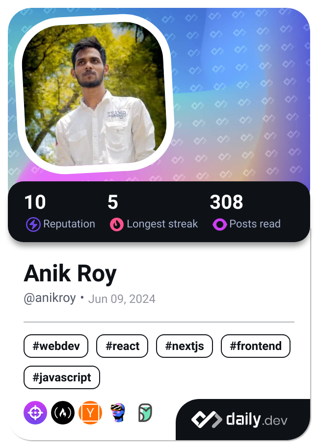

<h1 align="center">Hi 👋, I'm Anik Roy</h1>

### 💬 I am a skilled Full Stack Developer with a passion for building robust and scalable web applications. Currently, I am en exploring DevOps practices to deliver efficient and seamless development workflows.

- 🔭 I’m currently working on **Next Bazaar Web App**

- 💬 Ask me about **Laravel, MERN**

- 📫 How to reach me **anikkumerroy7@gmail.com**

- ⚡ Fun fact **I am non-cse**

### - Learning :
- ✨ Data Structures & Algorithms
- ✨ DevOps

### - Hobbies : 
- ✨ Music Addict
<h3 align="left">Connect with me:</h3>

  

 

### Tech Stack

I specialize in **JavaScript** and **TypeScript**, leveraging **Node.js** and **Laravel** for backend development. My expertise spans frameworks like **React** and **Next.js**, state management with **Redux Toolkit**, and data handling using **Prisma**, **Redis** and **Mongoose** for data handling. I work with **PostgreSQL**, **MySQL**, and **Tailwind CSS** for modern, scalable applications.

  

<!--

                                                                                 
,--------. ,--.                        ,--.                ,---.                 
'--.  .--' |  ,---.   ,--,--. ,--,--,  |  |,-.   ,---.    /  .-'  ,---.  ,--.--. 
   |  |    |  .-.  | ' ,-.  | |      \ |     /  (  .-'    |  `-, | .-. | |  .--' 
   |  |    |  | |  | \ '-'  | |  ||  | |  \  \  .-'  `)   |  .-' ' '-' ' |  |    
   `--'    `--' `--'  `--`--' `--''--' `--'`--' `----'    `--'    `---'  `--'    
                                                                                 
                                                                                  ,---. 
   ,--.                                 ,--.                    ,--.              |   | 
 ,-|  | ,--.--.  ,---.   ,---.   ,---.  `--' ,--,--,   ,---.    |  |-.  ,--. ,--. |  .' 
' .-. | |  .--' | .-. | | .-. | | .-. | ,--. |      \ | .-. |   | .-. '  \  '  /  |  |  
\ `-' | |  |    ' '-' ' | '-' ' | '-' ' |  | |  ||  | ' '-' '   | `-' |   \   '   `--'  
 `---'  `--'     `---'  |  |-'  |  |-'  `--' `--''--' .`-  /     `---'  .-'  /    .--.  
                        `--'    `--'                  `---'             `---'     '--'  
                                                                                                                                              
,------.         ,--. ,--.                                                                ,----.    ,--.   ,--.   ,--.  ,--.          ,--.    
|  .---'  ,---.  |  | |  |  ,---.  ,--.   ,--.   ,--,--,--.  ,---.     ,---.  ,--,--,    '  .-./    `--' ,-'  '-. |  '--'  | ,--.,--. |  |-.  
|  `--,  | .-. | |  | |  | | .-. | |  |.'.|  |   |        | | .-. :   | .-. | |      \   |  | .---. ,--. '-.  .-' |  .--.  | |  ||  | | .-. ' 
|  |`    ' '-' ' |  | |  | ' '-' ' |   .'.   |   |  |  |  | \   --.   ' '-' ' |  ||  |   '  '--'  | |  |   |  |   |  |  |  | '  ''  ' | `-' | 
`--'      `---'  `--' `--'  `---'  '--'   '--'   `--`--`--'  `----'    `---'  `--''--'    `------'  `--'   `--'   `--'  `--'  `----'   `---'  
                                                                                                                                              
                                                                                                             
 ,----.             ,--.          ,--.   ,--.           ,--.               ,--.         ,--.                 
'   ,  | ,--.  ,--. `--' ,--,--,  `--' ,-'  '-.  ,---.  |  ,---.   ,--,--. |  ,---.   ,-|  |  ,---.   ,---.  
|  |   /  \  `'  /  ,--. |      \ ,--. '-.  .-' (  .-'  |  .-.  | ' ,-.  | |  .-.  | ' .-. | | .-. : | .-. | 
'  '--'|   \    /   |  | |  ||  | |  |   |  |   .-'  `) |  | |  | \ '-'  | |  | |  | \ `-' | \   --. ' '-' ' 
 `----'     `--'    `--' `--''--' `--'   `--'   `----'  `--' `--'  `--`--' `--' `--'  `---'   `----'  `---'  
                                                                                                             

--->

  
  
  
   
   

 

